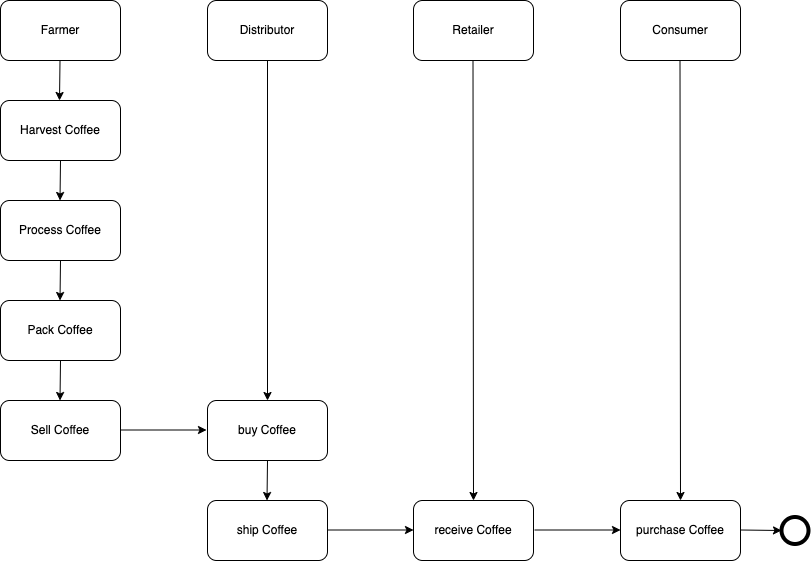

# Supply chain & data auditing

This repository containts an Ethereum DApp that demonstrates a Supply Chain flow between a Seller and Buyer. The user story is similar to any commonly used supply chain process. A Seller can add items to the inventory system stored in the blockchain. A Buyer can purchase such items from the inventory system. Additionally a Seller can mark an item as Shipped, and similarly a Buyer can mark an item as Received.

## Goerli address

https://goerli.etherscan.io/address/0x262D57e9F55f12C0Ed9ff0be72d8a7BAd3c82987

```
Deploying 'SupplyChain'
   transaction hash:    0x91b1bdae72116b8d14253b5ec59ee2d7e0cb7c32287bdff12ed20878ada23bd5
   Blocks: 2            Seconds: 20
   contract address:    0x262D57e9F55f12C0Ed9ff0be72d8a7BAd3c82987
   block number:        8391655
   block timestamp:     1674912276
   account:             0x299207fB116711cBe890cabE69369d24d621e843
   balance:             0.491506310600335288
   gas used:            3442288 (0x348670)
   gas price:           0.000000036 gwei
   value sent:          0 ETH
   total cost:          0.000000000123922368 ETH
```

## Node Version
```
node -v
v18.12.1

npm-v
8.19.2
```

## Truffle Version
```
truffle -v
Truffle v5.7.0 - a development framework for Ethereum
```

## web3 version number
```
npm view web3 version
1.8.1
```
## Activity Diagram



## Sequence Diagram


## State Diagram


## Data Modeling Diagram


The DApp User Interface when running looks like...


## Getting Started

These instructions will get you a copy of the project up and running on your local machine for development and testing purposes. See deployment for notes on how to deploy the project on a live system.

### Prerequisites

Please make sure you've already installed ganache-cli, Truffle and enabled MetaMask extension in your browser.

```
Give examples (to be clarified)
```

### Installing

A step by step series of examples that tell you have to get a development env running

Clone this repository:

```
git clone https://github.com/udacity/nd1309/tree/master/course-5/project-6
```

Change directory to ```project-6``` folder and install all requisite npm packages (as listed in ```package.json```):

```
cd project-6
npm install
```

Launch Ganache:

```
ganache-cli -m "spirit supply whale amount human item harsh scare congress discover talent hamster"
```

Your terminal should look something like this:


In a separate terminal window, Compile smart contracts:

```
truffle compile
```

Your terminal should look something like this:


This will create the smart contract artifacts in folder ```build\contracts```.

Migrate smart contracts to the locally running blockchain, ganache-cli:

```
truffle migrate
```

Your terminal should look something like this:


Test smart contracts:

```
truffle test
```

All 10 tests should pass.


In a separate terminal window, launch the DApp:

```
npm run dev
```

## Built With

* [Ethereum](https://www.ethereum.org/) - Ethereum is a decentralized platform that runs smart contracts
* [IPFS](https://ipfs.io/) - IPFS is the Distributed Web | A peer-to-peer hypermedia protocol
to make the web faster, safer, and more open.
* [Truffle Framework](http://truffleframework.com/) - Truffle is the most popular development framework for Ethereum with a mission to make your life a whole lot easier.


## Authors

See also the list of [contributors](https://github.com/your/project/contributors.md) who participated in this project.

## Acknowledgments

* Solidity
* Ganache-cli
* Truffle
* IPFS

